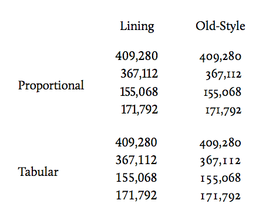

##字体漫谈

@(Fonts)[字体]

##### 1. 准备工作
`字符` - Character
`字形` - Glyph
`字型` - Font
`字体` - Typeface

- `字符`：字幕、数字、汉字、符号等，是一种抽象实体。
- `字形`：单个[字符]的具体表达，一个字可有多个不同的字形。原则上Unicode中只对`字`，而非字形编码。      
- `字型`：印刷行业中，指某一套具有同样样式和尺码的字形，如一整套中易宋体5号字、一整套9磅Helvetica 粗体字。
- `字体`：若干个[字型]在若干个尺寸上的集合。随着计算机字体（Computer font）的普及，可缩放的矢量字体的出现使得[字型]和[字体]的界限组件模糊，现今这两个概念在数字排版领域越来越多地被当做同义词使用。
```
[字体] - 宋体、仿宋体、黑体等...
```
例如Windows自带的[宋体]实为[中易宋体]。

##### 2. 字体分类
**按有无衬线**
- `衬线字体（serif）`
- `无衬线字体（sans serif）`


**按显示类型**
- `比例字体（proportional）` - 适合普通文本
- `等宽字体（monospance）` - 适合代码、ASCII art。HTML中的`<pre>`、`<code>`标签常为等宽代码。


**按数据格式**
- `点阵字体（bitmap/raster）`
- `轮廓字体（outline）`
- `笔画字体（stroke）`

`点阵字体`：本质上是`点阵图片`的集合。
1.  渲染极快
2.  显示效果稳定
3.  容易创建
4.  在小字号、多笔画时渲染效果较好
5.  视觉效果较差
6.  不适合缩放

`轮廓字体`：是`向量图`的集合，用Bézier曲线描述字形，适合缩放。
- `PostScript 字体`
- `TrueType 字体`
- `OpenType 字体`

`PostScript 字体` （PostScript轮廓）
1. Adobe开发
2. 用三次Bézier曲线描述字形
3. 私有hinting，价格昂贵
4. 质量高，适合打印专业质量的印刷出版物
5. 又细分为Type1/Type3/CID等类型

`TrueType字体`（TrueType 轮廓）
1. Apple为对抗Adobe的Type1与Microsoft共同开发
2. 用二次 Bézier曲线描述字形，渲染较快
3. 可内置点阵字体
4. 在OS X和Windows中是最常见的字体格式

`OpenType字体`
1. 源于Microsoft独自开发的TrueType Open
2. 后Adobe加入开发，增加对PostScript轮廓的支持
3. PostScript flavor / TrueType flavor


#####3. CSS Fonts

##### `CSS 2.1`
- font-family
- font-style
- font-variant
- font-weight
- font-size
- font

##### 字体匹配算法
`CSS 2.1 Font matching algorithm`
1. `UA` (浏览器的UA（user agent) )创建（或访问）一个CSS 2.1 相关属性的字体数据库；
2. 对每个元素的`每个字符`，先尝试匹配第一个`font-family`名字；
3. 找到则尝试匹配剩余属性（`font-style`,`font-variant`,...）;
4. 如果（1）没有完全匹配的字体，或（2）字体匹配但相应字形缺失，则尝试匹配下一个`font-family`;
5. 如果`font-family`无法匹配，UA分配默认字体；
6. 如果该字符在UA选择的所有字体下均无字形，UA应选择某个字体中的[missing character]的字形，例如[`�`]。

##### `font-family`
font-family: 宋体；
[宋体]定义在何处？

##### `name-Naming Table`
按OpenTypr规范，字体的名称信息存在`name 表`中。
- Name Records
  - Platform ID
  - Platform-specific encoding ID
  - Language ID
  - `Name ID`
  - ......

`Name IDs`(部分)
| ID | 含义|
1	Font Family name(Family)
2	Font Subfamily name(Style)
4	Full font name(Full)
6	PostScript name
16	Preferred Family
17	Preferred Subfamily
18	Compatible Full(OS X only)
21	WWS Family Name
22	WWS Subfamily Name
...


##### 自造字体测试结果


Firefox 4+ 下字体只要有 Preferred Family，就无法通过Family匹配。
`从[SimSun]来看应该是可以通过英文Family匹配的，这里的原因尚不明`


##### 4. Generic font families
有两种类型的名称可用于分类字体：**字体族名称（family-name）**和族类名称**（generic family）**。下面来解释这两个术语。

**字体族名称（family-name）**
字体族名称（就是我们通常所说的“字体”）的例子包括“Arial”、“Times New Roman”、“宋体”、“黑体”等等。
**族类（generic family）**
一个族类是一组具有统一外观的字体族。sans-serif就是一例，它代表一组没有“脚”的字体。
```
body {
	font-family: Helvetica, Arial, sans-serif;
}
```
- `Serif`
- `sans-serif`
- `cursive`(script)
- `fantasy`(decorative)
- `monospace`


影响默认值、fallback值因素：OS相关机制、浏览器配置、charset、lang属性、font-family中之前项的值。可参考[玉伯的实验](http://lifesinger.github.io/)

##### 相关机制
1. **`Windows`**
**FontSubstitutes**

2. **`Linux`**
[fontcofig](https://www.freedesktop.org/wiki/Software/fontconfig/)

1. **`Webkit`**
Webkit settings中可设定各个generic family 的默认值。
2. **`Firefox`**
访问[about:config]()后筛选出的font相关项中包含不同语言下generic families的默认值。
3. **`Opera`**(Presto)
[opera:config#CSSGenericFontFamily]()

##### font-style
normal | italic | oblique | inherit
**italic**为单独设计的斜体字体，而**oblique**则由普通字体变形而成


##### font-variant
normal | small-caps | inherit
允许使用同字体的大写字母缩小而成（甚至不缩小亦被允许）。


##### font-weight(never fail)
normal | bold | bolder | lighter | 100 | 200 | 300 ... | 900 | inherit
- normal = 400, bold = 700
- Book/Regular/Roman/Normal/Medium -> normal
- 由一系列`启发式规则`来指导映射
- 一般处理为<700均为[Regular]，≥700 为[Bold]


##### font-size(never fail)
absolute-size | relative-size | length | percentage | inherit
- absolute-size
  xx-small | x-small | small | medium | large | x-large | xx-large
  对应HTML字体的大小 1-7
- relative-size
  larger | smaller


##### **`未定义的内容`**
- **font-family** 是否支持localized names?
- **font-family** 是否支持Preferred Family?
- **font-style/font-weight/font-variation** 不满足时是否需要拟合？
- **font-family** 匹配失败 fallback 时默认字体的选择是否有讲究?

##### 5.讨论
**font-family**没有设定中文字体时，汉字应该怎么显示？
```
p{
	font-family: Helvetica;
}
p{
	font-family: Helvetica, serif;
}
```
两者有什么不同？

**Win 7 IE8+**

- **UTF-8**页面，默认serif字体会错误地优先使用朝鲜文字体[Batang];
- **GBK**页面除了前面这个问题外，默认sans-serif还会使用朝鲜文字体[Gulim]
```
<meta http-quiv="X-UA-Compatible" content="IE=EmulateIE7;">
```
可以缓解
- Win 7 下`其他浏览器`的serif/sans-serif汉字默认最终会落到[宋体]。

**OS X Safari 5**
- 默认serif 为[Times], 汉字会使用[华文宋体](STSong);
- 默认sans-serif为[Helvetica]，汉字会使用[华文黑体](STheiti);
- 所有family都缺字时Webkit中汉字按`首字体`来选择syetem fallback字体：
```
p.foo{
	font-family:Helvetica, Times;
}
p.bar{
	font-family:Helvetica, serif;
}
```
其中的汉字均会fallback为[华文黑体]

**OS X Chrome 18**
- 默认serif为[华文宋体]； 默认sans-serif为[华文黑体]。
- 没有generic family时，与Safari相同即按首字体fallback。
- 有generic family时，因为默认serif和sans-serif都包含汉字，故不需要再按收字体来fallback:
```
p{
	font-family:Helvetica,serif;
}
```
其中的汉字字体会根据serif选择为**[华文宋体]**

**OS X Firefox 11**
- 默认serif为[华文宋体]； 默认sans-serif为[华文黑体]。
- 没有generic family时，汉字总是通过system fallback选择[华文黑体]；
- 有generic family时，按配置项选择对应字体（默认配置中serif 和sans-serif字体均含汉字）
```
p.alpha{
	font-family: Times, Helvetica;
}
p.beta{
	font-family: Helvetica, Times;
}
p.gamma{
	font-family: Helvetica, serif;
}
```
其中前两条的汉字字体都会fallback为[华文黑体]，第三条为默认serif[华文宋体]。


**More...**
- Opera(Presto)对包含localized family的字体无法识别英文名字如[SimSun]
- Opera(Presto)在Windows下无视FontSubstitutes
- OSX 下的WebKit不识别localized family如[宋体]
......

##### 6. **建议**
- 尽量使用UTF-8编码并制定lang为zh-CN;
- 尽量指定generic family
- 默认font-family推荐
在 Windows 下，sans-serif 会默认采用「宋体」；OS X 下的「华文黑体」本就是通用选择。「Arial」换为「Tahoma」、「Verdana」等均可，可视设计而定。(可能引起文本对齐问题)
实在需要使用 GB2312/GBK 时，推荐去掉「sans-serif」，否则 Win 7 IE8+ 会错误使用「Gulim」。(亦可为 IE 写单独的 font-family)
- 对family name中的汉字进行Unicode编码一般情况下没有必要
- 尽量显式声明，避免让浏览器/操作系统选择自体
西文字体在中文前、将平台独有的字体在通用字体前、generic family 列最后。
```
"Lucida Grande", Verdana, "Hiragino Sans GB", "Microsoft YaHei", sans-serif;
```
- 特殊family name两边加引号
包括空格符、数字、除"-"外的特殊字符时建议加，但非必须。
- family name 名称统一
大小写建议统一，也尽量避免[宋体]、[SimSun]混用，有利于gzip.
- 中文font-size至少12px(SimSun < 12px 时难以辨识)

##### 鉴赏
**google.com / google.com.hk (首页、搜索「百度」结果)**
- arial,sans-serif
- Arial,sans-serif

**baidu.com (首页、搜索「百度」结果)**
- arial
- simsun
- "微软雅黑","黑体"
- Simsun
- arial,"微软雅黑","黑体"
- "方正隶书简体","Microsoft Yahei"

**taobao.com (首页)**
- tahoma,arial,"Hiragino Sans GB",\5b8b\4f53,sans-serif
- arial
- verdana,arial
- Microsoft YaHei, Hiragino Sans GB
- microsoft yahei
- "Microsoft YaHei,\5B8B\4F53"
- SimSun
- verdana
- "tahoma,arial,\5b8b\4f53,sans-serif"

**qq.com (首页)**
- "宋体","Arial Narrow",HELVETICA
- "\5B8B\4F53",arial,sans-serif
- Tahoma,Arial
- Tahoma
- Tahoma,"微软雅黑","MicrosoftYahei","宋体"
- Tahoma,"宋体"
- Arial
- "Microsoft Yahei"
- arial, simsun
- "\u7039\u5b29\u7d8b",arial,sans-serif
- ↑ "瀹嬩綋"


#### CSS Fonts Module Level 3
- **font-family**
- **font-weight**
- **font-stretch**
- **font-style**
- **font-variant**
- **font-size**
- **font-size-adjust**
- **font**
- **font-synthesis**
- **@font-face**
- **font features**
除`font-synthesis`和font features外的新内容都是从CSS 2删除的内容

##### font-family
- 明确了[family name 只能匹配一组字体，而非指定某个特定字体]；
- 明确了[必须可以通过本地化名称匹配字体]
- 附录中描述了对于OpenType和TrueType可以用作`font-family`匹配的字体名称：Family(ID 1), Preferred Family(ID 16), WWS Family(ID 21)
- 尚不完善

##### font-weight
- 总价了一个字重数值-样式名的对照表共参考：
- 

##### font-stretch
normal | ultra-condensed | extra-condensed | condensed | semi-condensed | semi-expanded | expanded | extra-expanded | ultra-expanded | inherit
用来选择自体的伸缩程度


##### font-size-adjust
`<number>` | none | inherit
aspect value : 字体的x-height 与 font-size 的比例

字体发生fallback以后，aspect value 可能会不一致，这个属性用来调整font-size使得不同的字体的x-height保持一致，取值为需要的aspect value值。


#####font-synthesis
none | [weight] || style]
默认weight style

- 显式地控制是否允许浏览器拟合字重合样式

####@font-face
```
@font-face {
    descriptor: value;
    descriptor: value;
    …
}

```
descriptor与CSS属性不同，用来[描述] Web font而非[选择]。

- font-family
- src
- font-style
- font-weight
- font-stretch
- unicode-range
- font-variant *
- font-feature-settings *

*这里添加的规则将影响字体的渲染结果，但不影响字体选择

##### src
是一系列字体资源的列表，优先使用UA能够使用的第一个资源，每个资源项后的文件类型描述可选。
```
src: url(fonts/simple.ttf);
src: url(basic.woff) format("woff"),
     url(fonts/basic.ttf) format("opentype");
```


读取本地字体
```
src: local(Baidu), // try local font first
     url(baidu.ttf) format("opentype");
```
对于 OpenType 和 TrueType 字体，仅匹配 PostScript name (ID 6) 或 full font name (ID 4)，且不支持 localized 名称。


##### unicode-range  [unicode-range 字体混搭](http://www.jianshu.com/p/7980ec695326)
```
@font-face {
    font-family: BBCBengali;
    src: url(fonts/BBCBengali.ttf) format("opentype");
    unicode-range: U+00-FF, U+980-9FF;
}
```

#####浏览器兼容性 [@font-face](http://caniuse.com/#feat=fontface
)

####font features
更好地利用字体的原声功能，提供更丰富的样式

#####font-variant-position

下标 vs 拟合下标

#####font-variant-position

合字（ligatures）

中文[合字]


##### font-variant-caps

小型大写字

#####font-variant-numeric

数字样式

####参考 [Font feature properties](https://www.w3.org/TR/css-fonts-3/#font-rend-props)
[Normalize-OpenType.css](http://kennethormandy.com/journal/normalize-opentype-css)


#### 7. 字体匹配算法
- 增加了最先进行 font-stretch 匹配
- font-style 匹配过程补完
- small-caps 不再放在字体匹配过程中处理，而加入到 font features
- Unicode variation selector 匹配成为必须


---------------------------------------------------------------
####**`其他资料`**
```

```

