#HTML

@(Database)[HTML]

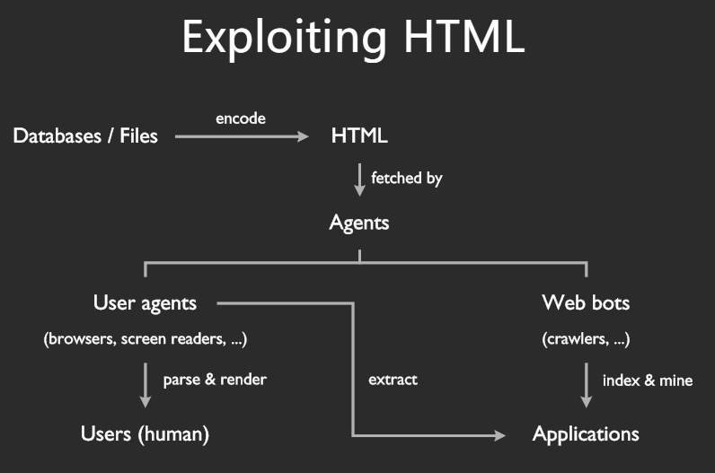


HTMl最终由机器读取解析，或进行渲染，或挖掘出有用的信息为其他应用提供支持。

- **[半结构化]**
- **如何提取内容**

##### 理解语义
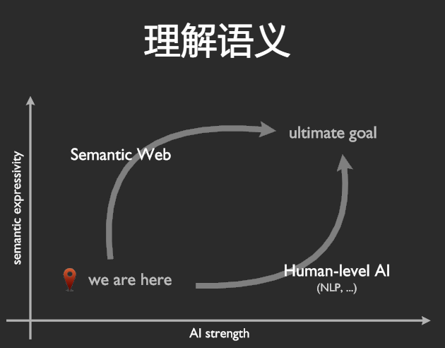


1. **元素 + 属性 + 属性值（+ 文档结构）**

1.1 **全局属性**

`id 属性`： 标示符（用于引用），不应依赖其语义处理相应元素
`class 属性`：authors are encouraged to use values that describe the nature of the content
`title 属性`： - 链接 - 描述目标信息
              - 图片 - 版权/描述
              - 引用 - 来源信息
              - 交互元素 - 操作指南

1.2 `lang 属性`： 内容的语言

**元数据（metadata）**

`head 元素` ： 一组元数据
`title 元素`： 文档对外的标题 （窗口标题/历史记录/搜索结果标题...）
`meta 元素` ：
- name/http-equiv/charset-
- name 属性决定种类，content属性表示内容
- 标准名称 （application-name,author,description,generator,keywords）
- 扩展名称：[WHATWG Wiki MetaExtensions](https://wiki.whatwg.org/wiki/MetaExtensions)
Baidu: mobile-agent, baiduspider
Twitter: twitter:card, twitter:image, twitter:creator:id
Google: application-url, google-site-verification, googlebot
360: renderer (未注册)

**链接 links**： 链接类型
- 外部资源链接 ： 指向用来组成当前文档的外部资源，通常由UA自动处理
- 超链接 ： 用来[导航]到其他资源（可以在UA中打开，下载...）

`link 元素`：
- 元数据，用来描述文档本身与其他资源的关系
- 必须包含`rel`和`href`属性，
            `<link rel="author license" href="/about">`
              `link`+`rel`+`author` ，`link`+`rel`+`license`都有预定的语义

`link+rel` :
- `rel="stylesheet"`
             链接到样式表(外部资源)
- `rel="alternate"`
             链接到当前文档的其他形式（超链接）
             `<link rel="alternate" type="application/rss+xml" title="Matt Mullenweg » Feed" href="http://ma.tt/feed/" />`

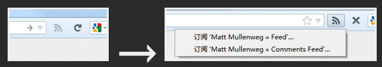

-`rel="alternate stylesheet"`
链接到可替换的样式表（外部资源）
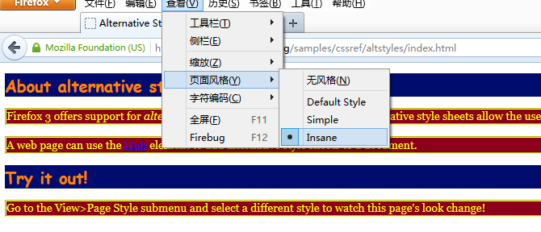
Firefox支持快速切换样式表[Try it in Firefox](https://developer.mozilla.org/samples/cssref/altstyles/index.html)

- `rel="prev", rel="next"`
  链接到文档的前一篇/后一篇/前一页/后一页（超链接），在生成站点目录、归档视图时很有帮助。

- `rel="icon"`
当前文档的favicon(外部资源)


**a 元素**
- 存在`href`属性时为超链接
- 缺少`href`属性时为链接占位符
```
<nav>
  <ul>
    <li><a href="/">Home</a></li>
    <li><a href="/news">News</a></li>
    <li><a>Examples</a></li>
  </ul>
</nav>
```
与`link`元素不同，`a`元素代表的超链接都是显式的


`a + rel` : -

- `rel="prev", rel="next"` 链接到文档的前一篇 / 后一篇 / 前一页 / 后一页 (超链接)
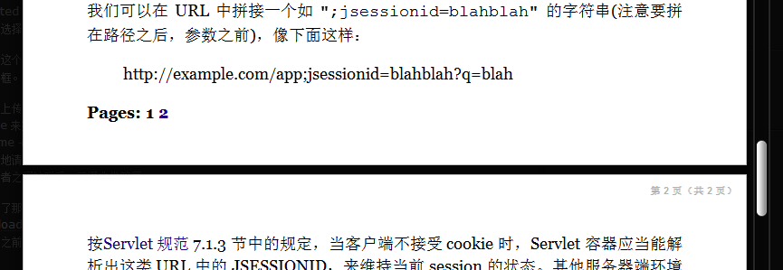

Safari的[阅读器]模式

- `rel="nofollow"`当前文档的作者并不推荐超链接指向的文档（超链接标注），由Google引入，他们认为适用场景有（[via](https://support.google.com/webmasters/answer/96569?hl=zh-Hans)）:不可信赖的内容；付费链接；按优先级别进行抓取（比如通知Googlebot不要抓取[注册]或[登陆]页面）
- 实际情况是，搜索引擎一般会抓取，但此链接一般不作为搜索结果排序的依据。现已被[microformats](http://microformats.org/)社区标准化。

`rel属性`
其他在HTML规范中预定义的`rel`属性值及其含义参见[HTML5 草案中 Link types 一节](http://dev.w3.org/html5/spec/links.html#linkTypes)

*************************************

**区块(sections)**

`article 元素`
- 独立的文档、页面、应用、站点
- 可以单独发布、重用
- 可以是...
一篇帖子
一篇文章
一则用户评论
一个可交互的 widget
...

`section 元素`
- 按主题将内容分组，通常会有标题 (heading)
- 并非「语义化的 div」
- 何时使用？
一个简单的评判标准：当你希望这个元素的内容体现在文档的**提纲 (outline) **中时，用 **section** 是合适的。

`nav 元素`
- a section with navigation links
```
<nav>
  <ul>
    <li><a href="/">Home</a></li>
    <li><a href="/news">News</a></li>
    <li><a>Examples</a></li>
  </ul>
</nav>
```
可以帮助UA 迅速获得导航内容，例如读屏器可以省去很多渲染直接跳到导航位置。
不一定要包含`ul`，也可以用自然文本进行导航

`aside 元素`
- 表示与周围内容关系不太密切的内容 (eg. 广告)
- 通常表现为侧边栏内容 (eg. 相关背景内容)、引述内容
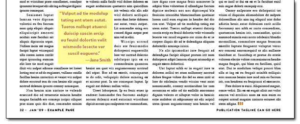


`h1``h6`元素

- 语义上等价
```
<body>
  <h1>Let's call it a draw(ing surface)</h1>
  <h2>Diving in</h2>
  <h2>Simple shapes</h2>
</body>
```

```
<body>
  <h1>Let's call it a draw(ing surface)</h1>
  <section>
    <h1>Diving in</h1>
  </section>
  <section>
    <h1>Simple shapes</h1>
  </section>
</body>
```

`header 元素`
- 一组介绍性描述或导航信息 (目录 / 搜索框 / logo / ...)
- 用来描述最近的父级区块
- 通常包含 h1–h6
- 不影响文档提纲的生成

```
<header>
  <p>Welcome to...</p>
  <h1>Voidwars!</h1>
</header>
```

`footer 元素`
- 代表最近的父级区块内容的页脚
- 作者信息 / 相关文档 / 版权信息
- 不影响文档提纲的生成

```
<footer><!-- site footer -->
  <nav>
    <p>
      <a href="/credits.html">Credits</a> —
      <a href="/tos.html">Terms of Service</a> —
      <a href="/index.html">Blog Index</a>
    </p>
  </nav>
  <p>Copyright © 2009 Gordon Freeman</p>
</footer>
```

`address 元素`
- 代表与最近父级 `article` 或整个文档关联的联系人信息

```
<address>
  <a href=".img/People/Raggett/">Dave Raggett</a>,
  <a href=".img/People/Arnaud/">Arnaud Le Hors</a>,
  contact persons for the <a href="Activity">W3C HTML Activity</a>
</address>
```

**实例： MDN**
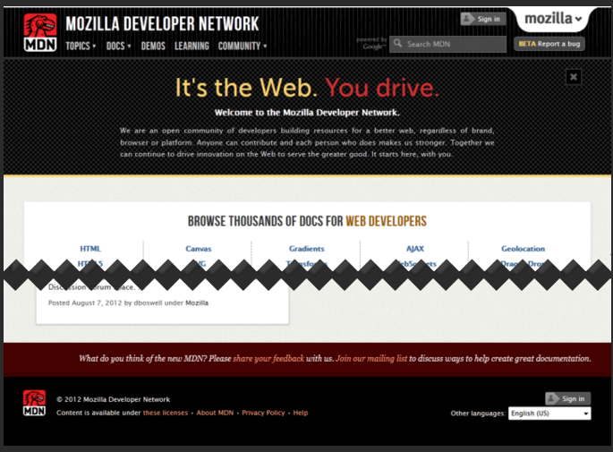
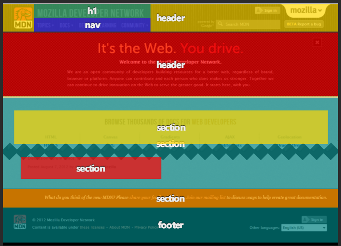

****************************


**分组内容 (grouping content)**

`p 元素`
- 段落」的显式表述 ：段落是主题接近的若干句子组成的文本块 (via)
- 非优先考虑的选择
  例如`address`的内容也是一个段落，但有更准确的语义

`hr 元素`
- 原意为「horizontal rule」(水平分隔线)
- HTML5 中重定义为不同主题内容间的分隔符
(eg. 故事场景的转换)
- 区块内容之间不需要用 hr 元素分隔

`pre 元素`
- 表示已排版的内容
- 代码片段 / ASCII art / ...

`blockquote 元素`
- 引用的来自其他来源的内容
- `cite` 属性表示该来源的 URL
- 署名必须放在 `blockquote` 外

```
<p>His next piece was the aptly named <cite>Sonnet 130</cite>:</p>
<blockquote cite="http://quotes.example.org/s/sonnet130.html">
  <p>My mistress' eyes are nothing like the sun,<br>
  Coral is far more red, than her lips red,<br>
  [...]</p>
</blockquote>
```

`ol, ul, li 元素`
- 有序 / 无序列表
- 改变列表顺序是否影响表达
- ol 下 li 元素的 value 属性代表该列表项的序号值

```
<p>Relegation zone:</p>
<ol>
<li value="18">Bolton Wanderers</li>
<li>Blackburn Rovers</li>
<li>Wolverhampton Wanderers</li>
</ol>
```

`dl, dt, dd 元素`
- 名值对的集合
- 术语定义表 / 元数据 / FAQ / ...

```
<dl>
  <dt><dfn>happiness</dfn></dt>
  <dd class="part-of-speech"><i><abbr>n.</abbr></i></dd>
  <dd>The state of being happy.</dd>
  <dd>Good fortune; success. <q>Oh <b>happiness</b>! It worked!</q></dd>
  <dt><dfn>rejoice</dfn></dt>
  <dd><i class="part-of-speech"><abbr>v.intr.</abbr></i> To be delighted oneself.</dd>
  <dd><i class="part-of-speech"><abbr>v.tr.</abbr></i> To cause one to be delighted.</dd>
</dl>
```

`figure 元素`
- 比较独立的、被主要内容引用的部分
- 插图 / 图表 / 照片 / 代码 / ...
- 通常会有一个标题 (figcaption)

`figcaption 元素`
- 图表标题 / 图例 / 代码说明 / ...

`div 元素`
- 本身无语义
- 可以和 class, lang, title 等属性结合，为一系列连续的内容增加语义
- 最后考虑的选择

`main 元素`
- 文档的主内容 / 应用的核心功能
- 唯一
- 对应于 ARIA role="main" (定义)

```
<main role="main">
  <!-- main content -->
</main>
```

***********************************
**文本级语义（text-level semantics）**

`em 元素`
- 表示侧重点的强调
- 强调级别由 em 的嵌套个数决定
- em 的位置不同，文本本身含义不同
- 在可视化 UA 上一般渲染为斜体

```
<p><em>Bats</em> can fly.</p>
<p>Bats <em>can</em> fly.</p>
<p>Bats can <em>fly</em>.</p>
```

`strong 元素`
- 表示内容的重要性
- 重要程度由 `strong` 的嵌套个数决定
- strong 的位置不同，文本本身含义不变
- 在可视化 UA 上一般渲染为粗体

```
<p><strong>Warning.</strong> A huge wave of zombies is approaching.</p>
```

`i 元素`
- 不再只是「斜体」
- 表示另一种叙述方式
- 画外音 / 分类学名词 / 外来语片段 / 舞台指示 / 船名 / ...
- 建议与 class / lang 属性搭配使用

```
<p>Sunflower (<i class="taxonomy">Helianthus annuus</i>) is an annual plant native to the Americas.</p>

<p>There is a certain <i lang="fr">je ne sais quoi</i> in the air.</p>

<p><i class="ship-name">Titanic</i> sank in the North Atlantic Ocean on 15 April 1912.</p>
```

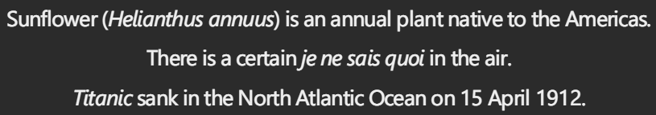

`b 元素`
- 不再只是「粗体」
- 表示某种需要引起注意却又没有其他额外语义的内容
- 摘要中的关键词 / 评介中的产品名称 / 文章的开篇内容 ...
- 建议与 class 属性搭配使用

```
<article>
  <h2>Kittens 'adopted' by pet rabbit</h2>
  <p><b class="lede">Six abandoned kittens have found an unexpected new mother figure — a pet rabbit.</b></p>
  <p>Veterinary nurse Melanie Humble took the three-week-old kittens to her Aberdeen home.</p>
[...]
```

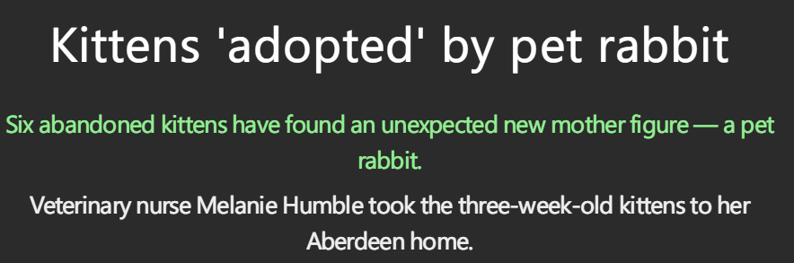

`small 元素`
- 不再只是「小字」
- [fine print](https://www.wikiwand.com/en/Fine_print)
- 免责声明 / 许可证声明 / 注意事项 / ...

```
<small><a rel="license" href="http://creativecommons.org/licenses/by-sa/3.0/">Creative Commons Attribution Share-alike license</a></small>

<small>请以实物为准，图片仅供参考</small>
```


`s 元素`
- 不再只是「带删除线的文字」
- 表示不再准确或不再相关的内容
- 与 `del` 元素含义不同

```
¥ <strong>76.5</strong> <s>原价79.0</s>
```
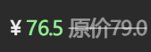

`u 元素`
- 不再只是「带下划线的文字」
- 表示用非文本进行的标注的内容
- 中文专名 / 拼写检查的错误内容 / ...

```
<u class="proper-name">屈原</u>放逐，乃賦<cite class="book-name">離騒</cite>。<u class="proper-name">左丘</u>失明，厥有<cite class="book-name">國語</cite>。（司馬遷《報任安書》）
```
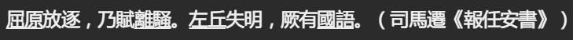

专名包括人名、地名、朝代名、国名、机构名等，大陆已较少使用，在英语中通常首字母大写

`cite 元素`
- 引述的作品标题
- 书 / 论文 / 散文 / 电影 / 歌曲 / 电视节目 / 画作 / ...

```
<p>My favorite movie is <cite>Transformers</cite> by Michael Bay.</p>
```

`q 元素`
- 引用的来自其他来源的段内内容
- cite 属性表示该来源的 URL
- 不用 q 而用引号亦正确

```
<p>The W3C page <cite>About W3C</cite> says the W3C's
mission is <q cite="http://www.w3.org/Consortium/">To lead the
World Wide Web to its full potential by developing protocols and
guidelines that ensure long-term growth for the Web</q>.</p>
```

`abbr 元素`
- abbreviation or acronym （[区别](http://www.benmeadowcroft.com/webdev/articles/abbr-vs-acronym/)）
- 其`title`属性的含义为所写的全程

```
<p>The <abbr title="Web Hypertext Application Technology Working Group">WHATWG</abbr> started working on HTML5 in 2004.</p>
```
建议在用户不熟悉的缩写词汇第一次出现时用`abbr`+`title`进行语义标注，帮助其理解

`dfn 元素`
- 用来展现一个术语的定义实例
- 最接近的父级段落、定义列表组或区块内容必须包含 dfn 元素指定术语的定义

```
<p>The <dfn><abbr title="Garage Door Opener">GDO</abbr></dfn>
is a device that allows off-world teams to open the iris.</p>
```
很容易抽取出特定术语的含义，从而很容易回答【What is ...?】类的问题

`time 元素`
- 为表述的内容增加一个机器可读的时间数据
- `datetime` 属性值必须是预定义的几种时间格式之一
- 如果不含 `datetime` 属性，则会解析其文本内容值

```
<div class="vevent">
  <a class="url" href="http://www.web2con.com/">http://www.web2con.com/</a>
  <span class="summary">Web 2.0 Conference</span>:
  <time class="dtstart" datetime="2005-10-05">October 5</time> -
  <time class="dtend" datetime="2005-10-07">7</time>,
  at the <span class="location">Argent Hotel, San Francisco, CA</span>
</div>
```

`time`元素与Microformats hCalendar 格式的配合使用


`code, samp, kbd 元素`
- code - 代码片段
- samp - 计算机程序的输出
- kbd - 用户输入的内容 / 按键
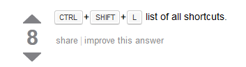

Stack Overflow 上 kbd 元素的样式让人一目了然

`mark 元素`
- 在引用的文字中使用，表示在当前文档中需要引起注意但原文中并没有强调的含义 (<small>eg. 对一篇文章的分析中对原文的标注)

- 表示与用户当前的行为相关的内容(<small>eg. 高亮显示搜索关键词)

```
<blockquote>
    <p>6月13日下午，<mark>一场大雨</mark>过后，正阳门箭楼被带着水雾的脚手架包裹得严严实实。北京旧城中轴线上的这座标志性建筑，正经历着新中国成立后规模最大的一次修缮。</p>
    ...
    <p>6月13日的<mark>那场大雨</mark>，将故宫端门外西朝房冲洗得干干净净。</p>
</blockquote>
<p>作者为什么两次提到6月13日那场大雨？请谈谈你的看法。</p>
```

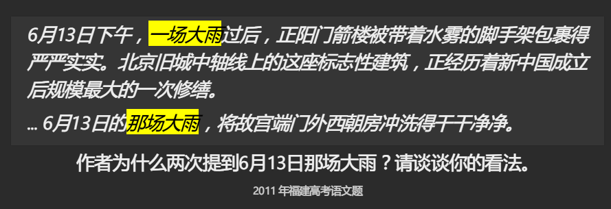

`ruby, rt, rp 元素`
- 注音标示，「ruby」来自日本印刷业
- 主要于 CJK 文字

```
<ruby>和<rp>(</rp><rt>hé</rt><rp>)</rp>谐<rp>(</rp><rt>xié</rt><rp>)</rp>社<rp>(</rp><rt>shè</rt><rp>)</rp>会<rp>(</rp><rt>huì</rt><rp>)</rp></ruby>
```

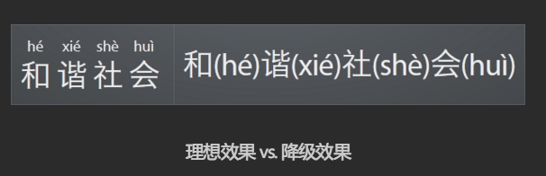


`span 元素`
- 本身无语义
- 可以和 class, lang 等属性结合，为文本片段增加语义
- 有更合适的元素时不应选择 span

```
<span class="keyword">var</span> greet = <span class="function"><span class="keyword">function</span><span class="params">()</span> {</span>
    console.log(<span class="string">"Hello world."</span>);
}
```

*****************************************

**更改记录（edit）**
`ins, del 元素`
- 表示对当前文档内容进行的增添与删改
- cite 属性指向对某个修改的说明文档的 URL
- datetime 属性表示了修改发生的时间 (取值规范)
- 用来记录文档的编辑历史

******************************************

**嵌入内容(embedded content)**

`img 元素`
- src, alt 属性决定了图片的含义
  - 有 src 且 alt 为空字符串，代表装饰用图
  - 有 src 且 alt 为非空字符串，图为文档内容的一部分
  - 有 src 且无 alt，图为内容一部分但无等价的文本内容可用
- 用 alt 文本替换图片，文档含义尽可能不变

```
<p>
  You are standing in an open field west of a house.
  
  There is a small mailbox here.
</p>
```

***************************************
**表格数据（tabular data）**

`table 元素`
- 用来表示超过一维的数据

`caption 元素`
- 表示所处的 table 的标题
- 当所处的 `table` 是外部 `figure` 元素的唯一子元素，应首选 `figcaption`

`tbody, thead, tfoot 元素`
- 均为一组表格行
- thead 表示列头 (通常为列标题，单元格用 th 元素)
- tfoot 表示列脚 (通常为列数据汇总)

`col, colgroup, tr 元素`
- 列，列组，行

`td, th 元素`
- `td` - 数据单元格
- `th` - 标题单元格
`th` 的 `scope` 属性表示标题对应的数据范围

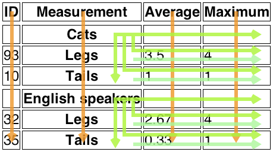


***********************************************
**进一步扩展**

`微格式（Microformats）`: Microformats 是 HTML 的扩展，用来标注人物/组织/事件/地点/简历/菜谱...
很多格式已是用业界的事实标准 [microformates](http://microformats.org/)

`Microformats 的基本思路` ：用HTML已有的元素/属性，配对属性值语义的扩展（主要针对`class`属性）以及对文档结构的约定来增强HTML的语义表达能力。Microformats的规范本质上就是对一系列常用类型数据HTML格式的约定。

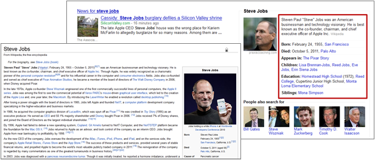

Google 通过从 Wikipedia 获取的 hCard 格式数据在搜索结果匹配出人物信息

`举例 ： hCard`
- 用来在Web上发布人物/公司/组织机构信息的格式
- 和vCard格式（MIME类型：`text/vcard`，RFC2426）定义的属性名值定义一一对应

```
<div class="vcard">
  <span class="fn">Sally Ride</span>
  <div class="org">Sally Ride Science</div>
  
  <a class="url" href="http://sally.example.com">w</a>,
  <a class="email" href="mailto:sally@example.com">e</a>
  <div class="tel">+1.818.555.1212</div>
  <time class="bday">1951-05-26</time> birthday
  [...]
</div>
```
人物名片的一部分

`其他 Microformats`

- [hCalendar](http://microformats.org/wiki/hcalendar) - 发布事件 : 基于 iCalendar 格式 (MIME 类型：text/calendar, RFC2445)
- [hReview](http://microformats.org/wiki/hreview) - 发布书评 / 影评 / 产品评价 / ...
- 对HTML `rel`属性值的扩展定义
`rel="license"`, `rel="tag"`, `rel="enclosure"`, ... 部分已经进入 HTML5 草案

*************************************

**微数据（HTML Microdata）**
- 允许在现有的文档中嵌入一组项的名值对集合 （[W3C草案](https://www.w3.org/TR/microdata/)）

`itemscope 属性` ： 用来标注描述项的位置

```
<div itemscope>
  <p>My name is <span itemprop="name">Elizabeth</span>.</p>
</div>
<div itemscope>
  <p>My name is <span itemprop="name">Daniel</span>.</p>
</div>
```

两个项，各有一个名为`name`的属性

`itemtype 属性` ：
- 如果期望服用已定义的项的模式，可用 `itemtype` 属性给出该类型的 `URI`
- 必须与`itemscope`属性置于同一元素上

`itemtype 属性`
- 当前项的属性名

`itemid 属性`
- 当前项的全局 ID (eg. ISBN（International Standard Book Number）)

```
<dl itemscope itemtype="http://vocab.example.net/book" itemid="urn:isbn:0-330-34032-8">
  <dt>Title</dt>
  <dd itemprop="title">The Reality Dysfunction</dd>
  <dt>Author</dt>
  <dd itemprop="author">Peter F. Hamilton</dd>
  <dt>Publication date</dt>
  <dd><time itemprop="pubdate" datetime="1996-01-26">26 January 1996</time></dd>
</dl>
```

`属性取值`
情况复杂，根据元素类型不同，取值方式各有不同
具体请参考`[Microdata 规范草案](https://www.w3.org/TR/microdata/#values)`
统一词汇表
请参考 [Schema.org](http://schema.org/docs/schemas.html)
<small>搜索引擎 (Google, Bing, Yahoo!) 建立，爬虫支持并理解用此词汇表中词汇表达的语义

**实例**
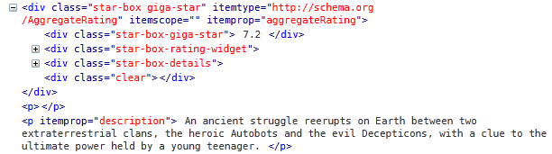

IMDB 的影片描述中嵌入了 microdata

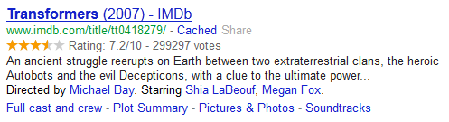

Google 通过获取 IMDB 的 microdata 数据将影片评分直接显示在搜索结果中


**Painting Order**
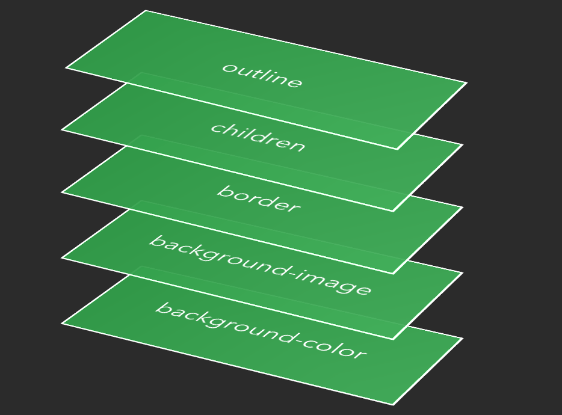


`Positioning Schemes`
- Normal flow
- Floats
- Absolute positioning

Determined by `position` and `float`

`Normal Flow`
- ·Block · Formatting Context
- ·Inline ·Formatting Context
- ·Flex ·Formatting Context
- ·Grid·Formatting Context
- Relative positioning

[BFC](http://www.w3cplus.com/css/understanding-bfc-and-margin-collapse.html) vs. [IFC](http://blog.fantasy.codes/front-end-dev/2013/03/10/zz-css-fundemental/)


