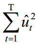
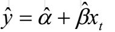

### 最小二乘法（OLS）和线性回归模型

@(NLP)[Statistics]

#### 一. 最小二乘法的基本属性

1. **函数关系**：Y=f(X1,X2,….,Xp)，其中Y的值是由Xi（i=1,2….p）所唯一确定的。
   **相关关系**：Y=f(X1,X2,….,XP) ，这里Y的值不能由Xi（i=1,2….p）精确的唯一确定。

`货币供应量和GDP散点图:由图中的点确定线的过程就是回归`

对于变量间的相关关系，我们可以根据大量的统计资料，找出它们在数量变化方面的规律（即“平均”的规律），这种统计规律所揭示的关系就是`回归关系（regressive relationship）`,所表示的数学方程就是`回归方程（regression equation）`或`回归模型（regression model）`。

图中的直线可以表示为：

根据上式，在确定α、β的情况下，给定一个x值，我们就能够得到一个确定的y值，然而根据式得到的y值与实际的y值存在一个误差。

以**ｕ**表示误差

即:

其中`t（=1,2,3,…..,T）`表示观测数。为一个简单的双变量回归模型（因其仅具有两个变量x, y）的基本形式。

其中 **yt** 被称作`因变量（dependent variable）`、被解释变量（explained variable）、结果变量（effect variable）；

**xt **被称作`自变量（independent  variable）、解释变量（explanatory variable）、原因变量（causal variable）

**α、β** 为 `参数（parameters）`,或称回归系数（regression coefficients）

**ｕt** 通常被称为`随机误差项（stochastic error term）`,或随机扰动项（random disturbance term）,简称`误差项`，

在回归模型中它是不确定的，服从随机分布（相应的，yt也是不确定的，服从随机分布）.

为什么将ｕt 包含在模型中？
（1）有些变量是观测不到的或者是无法度量的，又或者影响因变量yt的因素太多；
（2）在yt的度量过程中会发生偏误，这些偏误在模型中是表示不出来的；
（3）外界随机因素对yt的影响也很难模型化，比如：恐怖事件、自然灾害、设备故障等。

-------------------------------------------------

#### 二. 最小二乘法的基本属性

**普通最小二乘法（ordinary least squares,简记OLS）**

最小二乘法的基本原则是：最优拟合直线应该使各点到直线的距离的和最小，也可表述为距离的平方和最小。

α、β 估计值为
 

公式为：

直线上的yt值，记为  ，称为`拟合值（fitted value）`, 实际值与拟合值的差，记为  ，称为`残差（residual）` ，可以看作是随机误差项 的估计值。

根据OLS的基本原则，使直线与各散点的距离的平方和最小，实际上是使`残差平方和（residual sum of squares, 简记RSS）`   最小，即最小化：

 
 
 

根据最小化的一阶条件,求偏导，并令其为零，即可求得结果如下 :

总体回归方程（the population regression function，简记PRF），样本回归方程（the sample regression function，简记SRF）

总体回归方程（PRF）表示变量之间的真实关系，有时也被称为数据生成过程（DGP），PRF中的`α、β值是真实值`，方程为：

样本回归方程（SRF）是根据所选样本估算的变量之间的关系函数，方程为：

`SRF中没有误差项，根据这一方程得到的是总体因变量的期望值`

总体y值被分解为两部分：模型拟合值（  ）和残差项（    ）。

------------------------------------------------

#### 三. 最小二乘估计量的性质和分布

**线性关系**

1. 对线性的第一种解释是指：y是x的线性函数，比如，

2. 对线性的第二种解释是指：y是`参数`的一个线性函数，它可以`不是`变量x的线性函数。（即参数只以一次方出现，对解释变量x则可以是或不是线性的）。

**估计量（estimator）**和**估计值（estimate）**

估计`量`是指计算系数的`方程`；而估计`值`是指估计出来的`系数的数值`。

 若随机变量服从一个位置参数为  、尺度参数为  的概率分布，且其概率密度函数为:

**经典线性回归模型的基本假设**:

